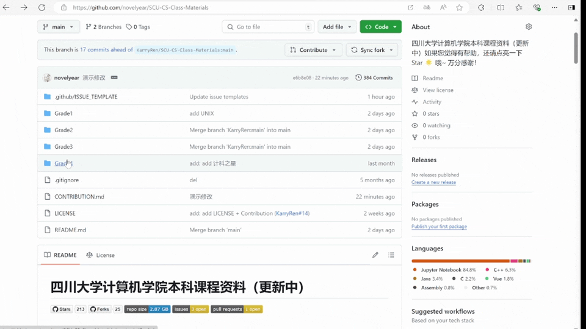

# SCU-CS-Class-Materials 资源贡献手册

> **本资源贡献手册是参考 [uestc 资源贡献手册](https://github.com/Xovee/uestc-course/blob/main/assets/贡献指南.md)编写，已征得原作者 [Xovee](https://github.com/Xovee) 同意 ✅，在此向作者团队表示衷心的感谢 ❤️**
>
> 关于本项目的初衷和说明，相信您已经在根目录的 [**README.md**](./README.md) 文件中已经了解得十分清楚。您能跳转到本手册中，说明您有意对本项目进行贡献和维护。
>
> 首先，**我们必须感谢您想要加入到我们**，能够将自己的课程资料开源 🙏 ！其次，**仓库的活力需要不断涌入的新鲜血液来维持，资源的时效性需要后继的贡献者来维护**，仓库资源能由简至臻，依赖于每位贡献者的无私贡献  🫶 ！最后，为了能让您快速地、尽量无成本地学习贡献方法，我们编写了本手册以期能够给予您恰当的指导 📑 ！ 当然，如果您在阅读和使用手册过程中遇到任何问题，可以直接[**联系我们**](KarryRenKai@outlook.com)进行交流，或[**发送 issues**](https://github.com/KarryRen/SCU-CS-Class-Materials/issues/new/choose) 进行交流，我们将会在第一时间做出解答！

[toc]

## **一、贡献途径**

### 1.1 贡献资料 ⭐

> 您可以通过提供资料的方法，为本仓库作出贡献。

**资源范围：**本仓库当前规划收录的资源为**四川大学计算机学院本科所有课程资料**，包括：

- 计算机**四大专业（计科、人工智能、计金、物联网）以及拔尖班**培养方案中的必修课与专业选修课资料；
- 相关跨专课程资料。

**资源类型：**  

- **复习资料**：包括但不限于各种期末期中复习重点、复习心得等资料，这也是本仓库的核心内容；
- **历年试题**：包括但不限于各种期末考试、期中考试、小测等考试资料；
- **过程性考核内容**：包括但不限于各种课堂作业、小组作业、实验报告等作业资料；
- **教材**：一般不直传教材资源，而只列举该门课程推荐教材信息供读者参考；对于思修、近纲、马原等思政课程，可上传学习指导选择题及答案部分；对于已经绝版或售价明显偏高的资源，则不受此限。

**需要注意**：

- **视频类资源**：请只提供链接；
- **声明不允许转载的资源**：直接提供原资源链接；
- **单个文件超过 25 MB**：由于无法在 issue 中直接附加，建议上传网盘，然后提供链接或提交 Pull Request（PR）；
- **课件类资源**：由于课件类资源不属于学生难以获取的资源，故在未经著作人许可的情况下，一般情况不直接上传课件资源。
- **单个文件超过 100 MB**：请以网盘链接的方式给出

### 1.2 完善资源🤝

> 您可以通过完善现有的资源，为本仓库作出贡献

**完善范围**：针对于已有的资料做出进一步补充完善，包括但不限于：  
- 完善试题标准答案；
- 对于同一课程提供不同资料；
- 对已有的较为粗糙的资料做出完善，如 fix type、完善排版等；
- 更新失去时效性的资料，如提供最新版思政课学习指导。

### 1.3 提出改进意见🧐

本仓库仍在不断完善，尚存在很多缺陷。如果您对本仓库有改进意见或建议，包括但不限于仓库的各种组织架构、设计细节等问题，可以移步[**发送 issues**](https://github.com/KarryRen/SCU-CS-Class-Materials/issues/new/choose) 处，发送**提出意见**的 issue，或联系仓库所有者 [**KarryRen**](KarryRenKai@outlook.com)。

### 1.4 加入仓库项目组 🤩

欢迎提交 PR 成为本仓库的 Contributor ！

## **二、贡献的规范**

> 由于目前仓库内容较多，请严格按照规范进行贡献资料。仓库管理者也将按照如下规范对内容进行严格审核。

### 2.1 需要避免的问题
**禁止上传 ❌** 请各位贡献者务必不要上传**无关资源**，包括但不限于：  

- 涉及隐私的，如电话号码、家庭住址、身份证号等个人信息；
- 包含对老师或课程主观评价的；
- 明确声明不准公开的；
- 版权侵犯、违规违法的，包括但不限于：
    - 违反宪法或法律法规规定的；
    - 危害国家安全，泄露国家机密，颠覆国家政权，破坏国家统一的；
    - 损害国家荣誉和利益的，损害公共利益的；
    - 煽动民族仇恨、民族歧视，破坏民族团结的；
    - 破坏国家宗教政策，宣扬邪教和宗教迷信的；
    - 散步谣言，扰乱社会秩序，破坏社会稳定的；
    - 散步淫秽、色情、赌博、暴力、凶杀、恐怖或者教唆犯罪的；
    - 侮辱或者诽谤他人，侵害他人合法权益的；
    - 含有法律、行政法规禁止的其他内容的。

### 2.2 文件规范

通过[**资料目录**](https://github.com/KarryRen/SCU-CS-Class-Materials?tab=readme-ov-file#-资料目录)，你可以发现，目前本仓库采取的是按照贡献者划分资源，这样能够让项目更好管理，同时能做到更好的溯源。

对于文件结构规范 🗂️，请参考以下管理规范，本资料目录共有 4 级，分别是：

1. **年级**（大一 Grade1、大二 Grade2、大三 Grade3、大四 Grade4）
2. **学期**（上学期、下学期）
3. **科目**（（必修/选修）\_教务系统官方课程名\_耳熟能详的课程简称）
4. **资料文件**（提供者\_上课年份\_分数）（请注意：部分贡献者不想暴露个人分数，所以用 `xx` 替代）

每一学期下都有一个 `README.md` 文件，该文件是对一学期课程的资料总览，包括 📖 **主要课程**和 🔈 **相关说明**。

对于每个`科目`文件夹，可按情况进一步细分`历年试题`、`复习资料`等子文件夹。在此我们对一些常见内容再做文件名规范 📄：

复习资料|历年试题|作业
---|---|---
不作规范，由贡献者自行命名。|`[考试时间]-[考试类型]-试卷` `[考试时间]-[考试类型]-答案` 例如： 2019年春-期末考试-试卷 2018年秋-期中考试-答案|`[布置时间]-[作业类型]` 例如 2019年春-课后作业 2018年秋-课堂作业-1 2018年秋-课堂作业-2

> 如果读者对于 markdown 文件的语法及 README.md 不熟悉，我们建议您阅读以下教程：
> - [markdown官方教程](https://markdown.com.cn/)  
> - [如何在github上写出漂亮的readme.md](https://github.com/Hubery-Lee/Notes/blob/master/%E5%A6%82%E4%BD%95%E5%9C%A8github%E4%B8%8A%E5%86%99%E5%87%BA%E6%BC%82%E4%BA%AE%E7%9A%84readme.md.md)

### 3.3 贡献前的检查
- 贡献者在贡献前请务必检查资料是否合规合法 ✔️，注意去除敏感个人信息，避免上传不可公开资料；
- 贡献者在贡献资料前请务必查重，即阅读完课程文件夹下所有贡献者的资料，确保自己想要贡献的资料没有被其他没读过用过的贡献者上传过。

## **三、贡献的具体方法和详细步骤**

### 3.1 Email、Issues 📧

GitHub 原为代码托管网站，对于不熟悉 GitHub 工作流程的读者来说，学习成本可能略高。如若读者熟悉 GitHub 的工作流程，我们推荐贡献者使用 `Fork + Pull Request` 的方式来进行贡献；对于其他情况，我们建议贡献者使用 Email 或者 Issue 的方式进行贡献，在您发送完资源后，仓库维护者会将您发送的资源按照规范添加到仓库中。

**贡献的步骤如下**：

1. 检查您要贡献的资源是否已经存在，是否符合仓库收录的范围；
2. 按照本手册上述规定检查资源有无隐私内容、违规内容、版权问题等；
3. 使用 Email 或者 Issue 把资源发送给我们（建议压缩为 ZIP 文件）。

分别来看，您有两种方法将资源发送给我们：

- Email 地址：KarryRenKai@outlook.com（请添加必要的说明）
- Issue 的使用方法（需要登录 GitHub 账号）：
  1. 进入仓库首页；
  2. 点击仓库名 `SCU-CS-Class-Materials` 下的 `Issues` 选项卡；
  3. 点击 `New Issue` 按钮；
  4. 选择贡献资源 `Issue` 模板，点击`Get started`；
  5. 根据输入框内的指引，上传资源文件，点击 `Submit new issue` 按钮即可。

### 3.2 Pull Request（PR） 😎

除了使用 Email 和 Issue，贡献者们亦可以使用 Pull Request 为仓库添加、修改、或删除内容。Email 和 Issue 的原理是：贡献者将资源发送给仓库的维护者，然后维护者再将资源添加到仓库中；**而 Pull Request 则是贡献者直接对仓库进行改动，进行各种操作，在改动完成后，向仓库提交 Pull Request**；仓库的维护者然后会对 Pull Request 进行审核，审核通过后，将 Pull Request 中的改动，合并到仓库之中。**这时你就成为[贡献者](https://github.com/KarryRen/SCU-CS-Class-Materials/graphs/contributors)之一啦！🔥**

由于 Pull Request 的使用门槛较高，故对于不熟悉 GitHub 工作流程的贡献者，我们推荐您使用 Email 和 Issue 来进行贡献。如果您熟悉 GitHub 的各种操作，那就请直接提交 Pull Request 吧！如果您想要学习 Github 的使用流程，可阅读（1）[Git官方文档](https://git-scm.com/book/zh/v2)；（2）[菜鸟教程 | Github简明教程](https://www.runoob.com/w3cnote/git-guide.html)；（3）[Github官方文档 | Hellow World](https://docs.github.com/zh/get-started/start-your-journey/hello-world)；（4）[Github官方文档 | 参与项目](https://docs.github.com/zh/get-started/exploring-projects-on-github/contributing-to-a-project)

不过我们也提供了Pull Request的简易教程，按照以下步骤，就可以轻松创建Pull Request啦！🎉  

**注意**：  
- 途中遇到任何问题请尝试自行搜索解决，如分支冲突、远程连接失败等 ❗
- 对于从未使用过 Github、Git bash的准贡献者，建议学习上述文档后再跟随该简易教程❗

步骤|示例
---|---
我们首先要做的是 Fork 仓库，点击仓库首页右上角的 `Fork` 按钮。进入下一页面后点击`Create fork`即可。|
之后会进入一个同名仓库，但所有者变成了您 在仓库名下方会有`forked from KarryRen/SCU-CS-Class-Materials`|
然后就可以对您 Fork 的仓库做各种改动， 例如修改 CONTRIBUTION.md 文件；修改完成后， 点击按钮提交 `Commit`。|
您也可以上传文件或者文件夹， 进入您想要上传资源的目录， 点击右上角的 `Add file`，再点击`Upload files` 按钮， 选择或者拖动文件/文件夹到网页中间的框内，然后提交 `Commit`。 例如上传`大四上`资料，注意示例中图方便并未新增贡献人文件夹|
假如您对 Fork 的仓库提交了18次 `Commit`， `This branch is 18 commits ahead of Xovee:master` 表示当前分支比源仓库领先 `18` 个提交。|
回到仓库首页，点击状态条右侧的   `Contribute` 按钮，再点击`Open pull request` 按钮，即可创建 PR。|  

作者：novelyear
